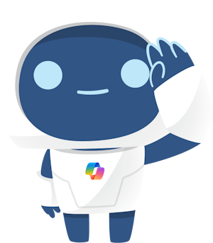
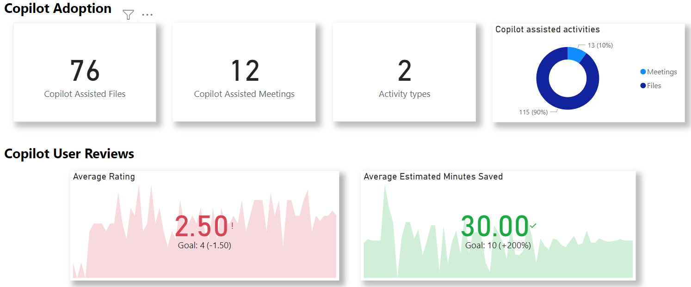

# Copilot Feedback Bot
Get real feedback from your organisations users about how copilot is helping, with "Copilot Feedback Bot".



This is a bot that collects user feedback about copilot use within M365 so you can see exactly what your users think about it. Do your users love copilot? Does it really save them time? Doing what actions? Do some groups of people like it more than others?

More importantly: is it worth the investment? This is the question this system seeks to quantify in more detail than anything else. 



Copilot events are detected automatically, and each user that used copilot will be surveyed about how that interaction went through a Teams bot. 


User responses are stored in a database and visualised in Power BI.


## Usage
When deployed, a web-job will read the Office 365 Activity API to determine copilot interactions - whom, and what. It runs automatically once a day. 

A functions app will then find users that have new activity and start a new conversation with them to ask if they could review the activity in question with copilot. 

Once surveyed they won't be surved again for that specific interaction (even if they don't answer). 

If the user doesn't have the bot installed in Teams already, it'll be installed automatically.

If the user says anything to the bot outside the normal dialogue flow, the assumption is they want to leave a copilot review. Surveys don't necessarily have to correlate to a specific interaction, the user can just leave general feedback too. 

# Setup Steps
For this, we assume a decent knowledge of Teams apps deployment, .Net, and Azure PaaS. 

## Create Bot and Deploy Teams App
Note, that for all these steps you can do them all in PowerShell if you wish. I’m not a sysadmin so this is what works best for me. 

You need Teams admin rights and rights to assign sensitive privileges for this setup to work. It's a bot that proactively installs itself and asks users. 

1. Go to: https://dev.teams.microsoft.com/bots and create a new bot (or alternatively in the Azure Portal, create a new Azure bot - the 1st link doesn't require an Azure subscription).
2. Create a new client secret for the bot application registration. Note down the client ID & the secret of the bot.
3. Grant permissions (specified below) and have an admin grant consent.
4. Optional: you can create another app registration for the more sensitive privileges if you need (service account). The config supports having x2 accounts, but one can be used for both. 

Next, create a Teams app from the template:
4. In "Teams App" root dir, copy file "manifest-template.json" to "manifest.json".
5. Edit "manifest.json" and update all instances of ```<<BOT_APP_ID>>``` with your app registration client ID. 
6. Make a zip file from "color.png", "manifest.json", and "outline.png" files in that folder. Make sure all files are in the root of the zip. 
7. Deploy that zip file to your apps catalog in Teams admin.
8. Once deployed, copy the "App ID" generated. We'll need that ID for bot configuration.

## Create Azure resources. 
Create these resources:
9. App service & plan. B1 level recommended for small environments. 
10. Functions app - consumption plan recommended. May require it's own resource-group.
11. Application Insights (link app service & functions app to it)
12. Storage account.
13. Service bus namespace.
14. SQL Database (and server) - the PaaS version.

## Configuration
These configuration settings are needed in the app service & functions app:

Name | Description
--------------- | -----------
AppCatalogTeamAppId | Teams app ID once deployed to the internal catalog
MicrosoftAppId | ID of bot Azure AD application
MicrosoftAppPassword | Bot app secret
WebAppURL | Root URL of app service
AuthConfig:ClientId | Service account 
AuthConfig:ClientSecret | Service account 
AuthConfig:TenantId | Service account 
ConnectionStrings:Redis | Redis connection string, used for caching delta tokens
ConnectionStrings:ServiceBusRoot | Used for async processing of various things
ConnectionStrings:SQL | The database connection string.
ConnectionStrings:Storage | Connection string. Conversation cache and other table storage

ConnectionStrings go in their own section in App Services. If any values are missing, the process will crash at start-up. 

## Application Permissions
Graph permissions needed (application):
* User.Read.All - for looking up user metadata, allowing activity & survey slicing by demographics (job title, location etc)
* Reports.Read.All - for reading activity data so we can cross-check who's active but not using copilot. 
* TeamsAppInstallation.ReadWriteForUser.All - so the bot can proactively install itself into users Teams, to start a new conversation. 

Office 365 Management APIs
* ActivityFeed.Read - for detecting copilot events. 

All these permissions need administrator consent to be effective. 

## Deploy Solution
Work in progress, but there is a GitHub action in ".github\workflows\buildwebandwebjob.yml" that will build and deploy the app service & webjob. 
Requires secret "feedbackbot_PUBLISH_PROFILE". 

Otherwise, publish from Visual Studio is also a (temporary) solution. 
